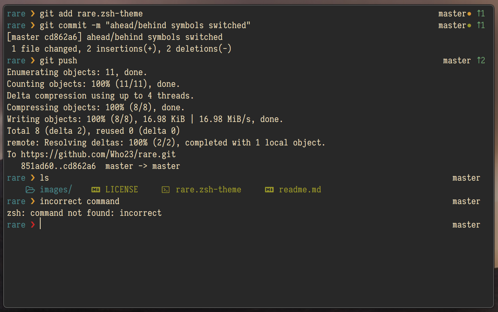

<p align="center">
  
<p align="center">A fork of <a href="https://github.com/jackharrisonsherlock/common">common</a>, a simple, clean and minimal prompt.</p>

<p align="center"></p>

- Current working directory
- Hostname (Shown on remote SSH shell only)
- AWS Vault Role
- Background jobs
- Exit code of last command
- Git branch/status
- Customisable colour scheme

And added by rare:
- Improved git status with untracked, unstaged, and staged 'traffic lights', commits ahead/behind of origin
- Working colors/bugfixes on segments

## Installation

Run this script:
```sh
wget -O ~/rare/rare.zsh-theme https://raw.githubusercontent.com/Who23/rare/master/rare.zsh-theme
```

Update your `.zshrc` file with:
```sh
source ~/rare/rare.zsh-theme
```

Feel free to file an issue for a feature request or a bug you found!